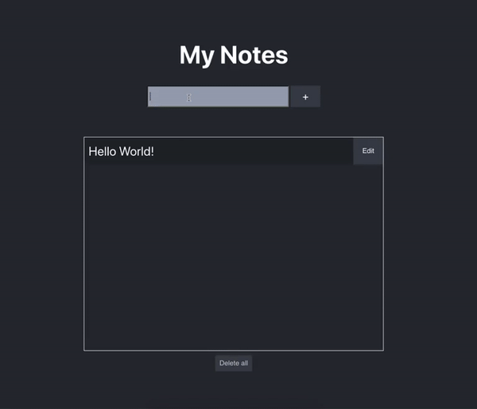

# My Notes Web App

A React web application that allows users to quickly save short notes. This was a small project for me to get to grips with TypeScript and React together.

  

Website is hosted at [Netlify](https://simple-notes-app.netlify.app/).

## Instructions

1. Clone the repo or download all the files
2. Install all the dependencies with `yarn install`
3. Start the development server with `yarn start`

## Authors

* Ivan Cheng 
